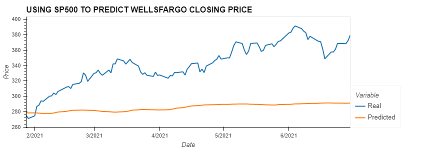

# p2-g3
FinTech Project 2

# Data
Data Pulled from following

Alpaca [Alpaca's Website](https://alpaca.markets/)

Newsapi [Newsapi's Website](https://newsapi.org//)

Nasdaq [Nasdaq's Website](https://www.nasdaq.com/)

Cdc [cdc's Website](https://www.cdc.gov/)

Quandl [Quandl's Website](https://www.quandl.com/)

Cushing, OK WTI Spot Price FOB, Daily [Cushing's Website](https://www.quandl.com/data/EIA/PET_RWTC_D-Cushing-OK-WTI-Spot-Price-FOB-Daily)

Our world in data [our world in data Website](https://ourworldindata.org/)

# Data cleaning process
Pull in data through api and csv, clean the data, dropped null, rename columns and read clean data to an output file.

# Analysis
## Auto Analysis
* I used Tesla, GM, and Ford in my analysis. 
## Auto Result
* To summarize, due to insufficient data, I had little confidence in the correlation result shown for Tesla and Inflation (approx. 32%). All LSTM models had poor results, regardless if the S&P 500 or COVID were the features, and the targets were all three auto makers.  

## Tech Analysis
* 
## Tech Result
* 
    Samuel area to fill out 

## Finance Analysis
presentation is base on the analysis of the financial sector.

* In which i analyized goldman sach closing price returns with an NLP Sentiment score, using 30 days of headline from news api on an LSTM model. Base on result render below we can see that this model perform poorly and its not a good fit in using sentiment score in prediting returns due to insufficent data.

* So as a result of insufficent data from the first model i decide to look another model which could work better with the limitation of my data.

*  Random forest regressor model with a given a window size and we can conclude from the R2 score of -0.31 this model perform beyound reasonable worst than the LSTM model.

* Another random forest regressor model was built without a window size which has an r2 score of 0.79, therefore we can conclude that random forest regressor model perform better without a given window size and does fairly good at predicting how sentiment score affect the stock returns

* My third model is also an LSTM Model using sp500 closing price to predit wellfargo closing price, there was not a strong correlation. We can see begining february a divergent occur where close price begining to accerlerate and the predicted price remain almost constant, as a result of this, my finding is that this model did not do a good job using sp500 to predict the closing price of Well's fargo. Now with this model, data was not an issue but rather there was poor correlation between sp500 and Wells'fargo.

  

## Finance Result 
* my conclusion is based on the different model we look at, is that your data and the model choosen place a big row in the outcome of your prediction.
    

# Conclusion   
    Base on our analysis iwe can infer that 