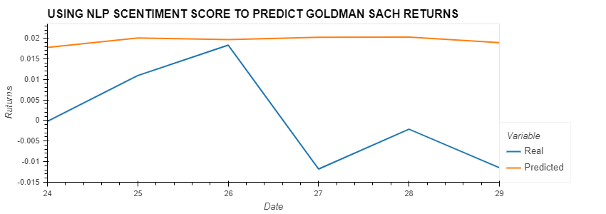

# p2-g3
FinTech Project 2

# Data
Data Pulled from following

Alpaca [Alpaca's Website](https://alpaca.markets/)

Newsapi [Newsapi's Website](https://newsapi.org//)

Nasdaq [Nasdaq's Website](https://www.nasdaq.com/)

Cdc [cdc's Website](https://www.nasdaq.com/)

Quandl [Quandl's Website](quandl.com)

Cushing, OK WTI Spot Price FOB, Daily [Cushing's Website](https://www.quandl.com/data/EIA/PET_RWTC_D-Cushing-OK-WTI-Spot-Price-FOB-Daily)

Our world in data [our world in data Website](https://ourworldindata.org/)

Google Docs presentation: https://docs.google.com/presentation/d/1iC6t7wNHQegqLx0QN4VlAqQdERtoBtwLsPdA7Dac9QM/edit?usp=sharing

# Data cleaning process
Pull in data through api and csv, clean the data, dropped null, rename columns and read clean data to an output file.

# Analysis
## Auto Analysis
I used Tesla, GM, and Ford in my analysis. 
## Auto Result
To summarize, due to insufficient data, I had little confidence in the correlation result shown for Tesla and Inflation (approx. 32%). All LSTM models had poor results, regardless if the S&P 500 or COVID were the features, and the targets were all three auto makers. 
## Tech Analysis
## Tech Result
    Samuel area to fill out 

## Finance Analysis
My presentation is base on the analysis of the financial sector.
* in which i analyized goldman and sach closing price with an NLP Sentiment score, using LSTM model. base on result render below we can see that this model perform poorly and its not a good fit in using sentiment score in prediting closing price, as from insufficent data.

* so as a result on insufficent data from the first model i decide to look another model which could work better with the limitation of my data.

*  Random forest regressor model with a given a window size was use and we can impile from the R2 score of -0.31 that model perform worst than the LSTM model 

* Another random forest regressor model was built without a window size and we can see from the R2 score of 0.79.we can clear say that the random forest regressor perform better without a given window size and does a fairly good result at predicting how sentimen score affect the closing price.

* The third model is also an LSTM Model using sp500 to predit wellfargo closing price and can also see that this model did not do a good job predicting the closing price of Well's fargo

  

## Fiance conclusion 
* my conclusion base on the model buit is that the data and the model choosen place a row in the outcome of your prediction.
    

# Conclusion   
    Base on our analysis, we can infer that